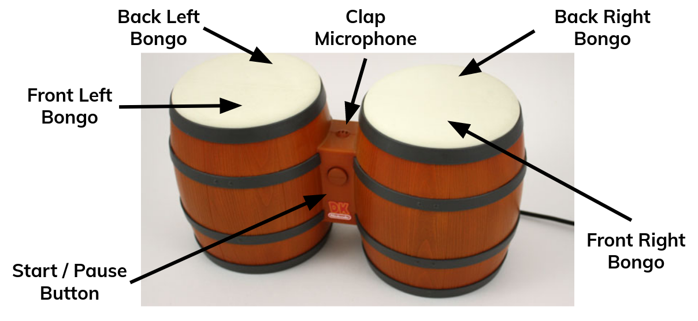
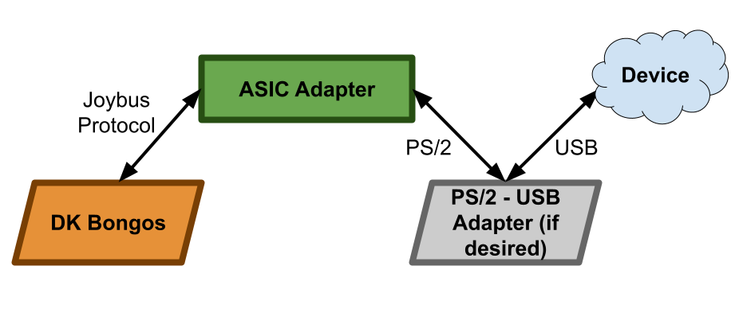

# __DK BANANAS__: DK Bongos Adapter Newly Accelerated by Application Specific Integrated Circuits

The world's first hardware accelerated DK Bongos - PS/2 Keyboard adapter

---
## Introduction: What are the DK Bongos?

The DK Bongos only have six inputs. Each bongo is split into two halves, a front
button and a back button. The remaining two controller inputs are the "Start /
Pause" button on the side of the center block and a microphone situated on the
top of the center block.

## History

On September 27th, 2004, Nintendo released the rhythm game
[_Donkey Konga_](https://en.wikipedia.org/wiki/Donkey_Konga) for the GameCube.
When fans purchased the game, they also received the DK Bongos, a GameCube
controller disguised as a pair of bongo drums, albeit with only a limited number
of inputs. Nintendo would go on to continue the series, releasing _Donkey Kong_
_Jungle Beat_ and _Donkey Konga 2_ worldwide in the spring of 2005. Japan also
saw an exclusive third release, _Donkey Konga 3_, which was never released
outside of Japan. These new releases received increasingly negative reviews, and development on the series was canceled. While the hope for new _Donkey Konga_
titles may have died off, the DK Bongos have lived on.

The DK Bongos have been a passion of mine for - well, too long. It all started
with a question and a joke between my housemates over dinner: what makes a
programmer a _real_ programmer? We may have not been
[the first people to ask that question](https://xkcd.com/378/), but the truth
is still astounding: a software program is just a _very_ specific ordering of
ones and zeros. Leaning back in my chair at the dinner table, I remembered the
VR videogame [Job Simulator](https://en.wikipedia.org/wiki/Job_Simulator).
There's a keyboard in this game with only a "1" key and a "0" key. That's when
it hit me. A _real_ programmer truly only needs two things to write software: a
one and a zero. And so was born the binary keyboard, made possible by Nintendo's obscure controller.

This hobby project has been a surprisingly good learning opportunity for many
things: memorizing binary and hexadecimal; learning the Instruction Set
Architecture (ISA) underneath ARMv7; becoming familiar with ELF binaries. Now,
the DK Bongos lead me deeper once more: the world of digital design and ASICs.

---
## Problem Statement

The DK Bongos utilize the [Joybus Protocol](https://n64brew.dev/wiki/Joybus_Protocol),
sometimes referred to as the [GameCube Controller Protocol](http://www.int03.co.uk/crema/hardware/gamecube/gc-control.html),
to interface with the GameCube console. To interface the DK Bongos with
something other than the GameCube, fellow bongo enthusiasts - such as streamers
who love to [play videogames with obscure controllers](https://www.youtube.com/watch?v=mh-6k8TmUd8&t=69s) -
must purchase an adapter which converts the GameCube Controller Protocol to USB.
While there is software to read the USB input and bind it to certain actions or
keys, it is often clunky and not compatible with all operating systems.

My first pass at turning the DK Bongos into a binary keyboard was to buy one of
these GameCube-to-USB adapters and to use a
[custom Python program running on a Raspberry Pi](https://github.com/johnDeSilencio/Donkey-Kong-Jungle-Beat-Binary-Keyboard)
to map button presses with keybindings. But the setup was clunky, with a
Raspberry Pi running the program to translate the USB output from the adapter; I
could not use the DK Bongos in any other program, e.g. hexedit. That is why,
in the spirit of being _real_ programmers, we now joyfully turn to replacing the
adapter and the Raspberry Pi with our custom hardware.

---
## Goal

This ASIC converts the serial output of the DK Bongos, which is encoded using
the GameCube Controller Protocol, to a serial output which is
[PS/2 encoded](https://en.wikipedia.org/wiki/PS/2_port#Communication_protocol).
With a hardware adapter, the DK Bongos have the potential to become like any
PS/2 keyboard, agnostic to both application software and operating system. A
hardware adapter frees the hobbyist to use the bongos in ways and applications
which were not possible before, and certainly _never_ intended by Nintendo.

---
## Where We're Going

If we can successfully design an ASIC to convert the Joybus Protocol output from
the DK Bongos to valid PS/2, then the hope is to fabricate these ASICs courtesy
of the [Google / Skywater / Efabless Multi-Project Wafer (MPW) program](https://efabless.com/open_shuttle_program).
If our project is selected for tapeout, we plan to continue hardware development
with the design of a PCB and casing to produce a fully-functional prototype.

---
## Additional Links:

* [GameCube Controller Protocol on the DK Bongos](docs/DATASHEET.md)

---
## Credits:

* http://www.int03.co.uk/crema/hardware/gamecube/gc-control.html
* https://n64brew.dev/wiki/Joybus_Protocol
* Benjamin H. Powers, for believing in the dream / meme of binary keyboards and
for hearing my new ideas with the same enthusiasm I had, no matter how crazy
they must have seemed
* Benjamin P. Reilly, for being my closest friend, a role model of courage, and
for inspiring me to be the best engineer I can be
* Scott A. Tornquist, for encouraging me to see the best in myself and for never
giving up on me, even when I wanted to give up on myself
