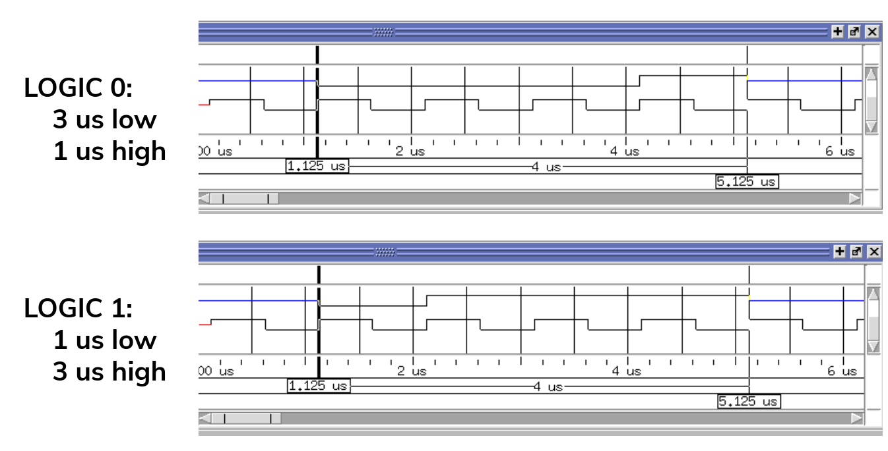
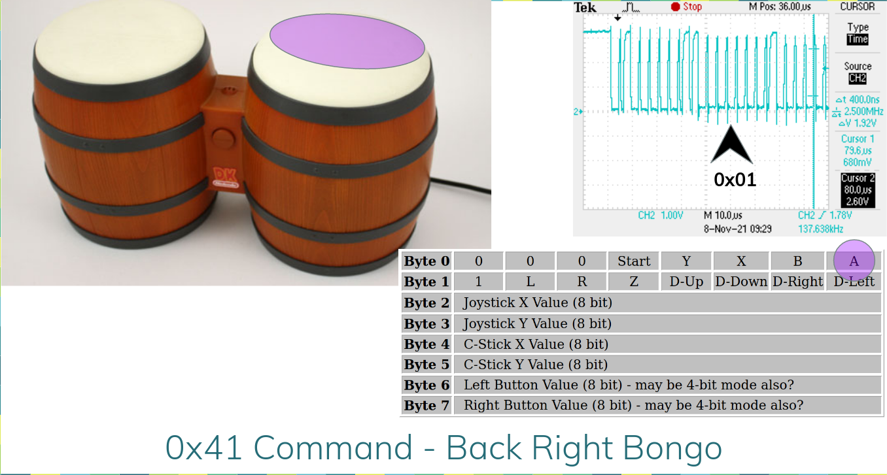
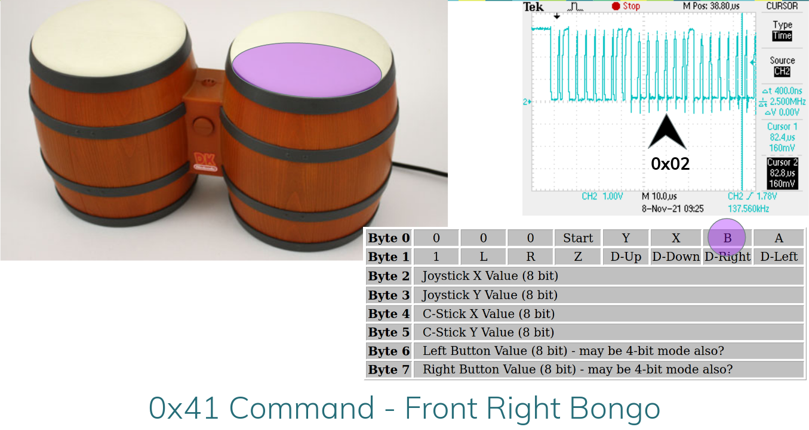
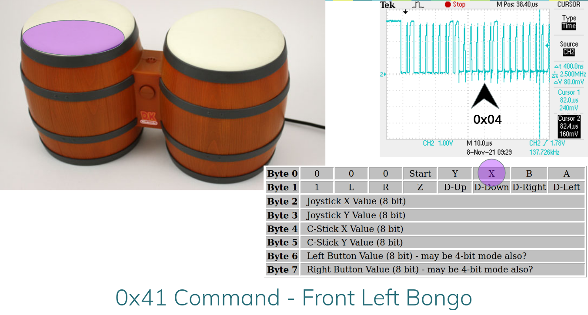
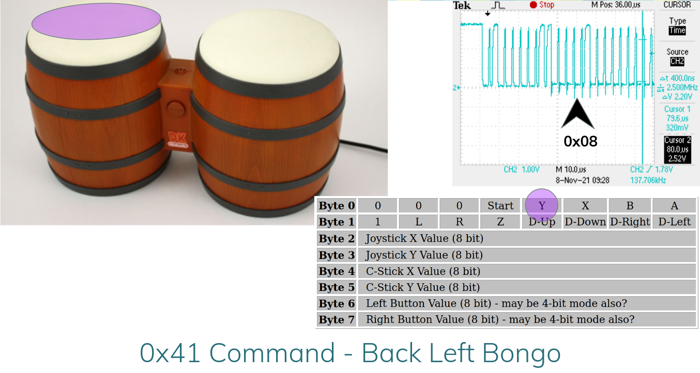
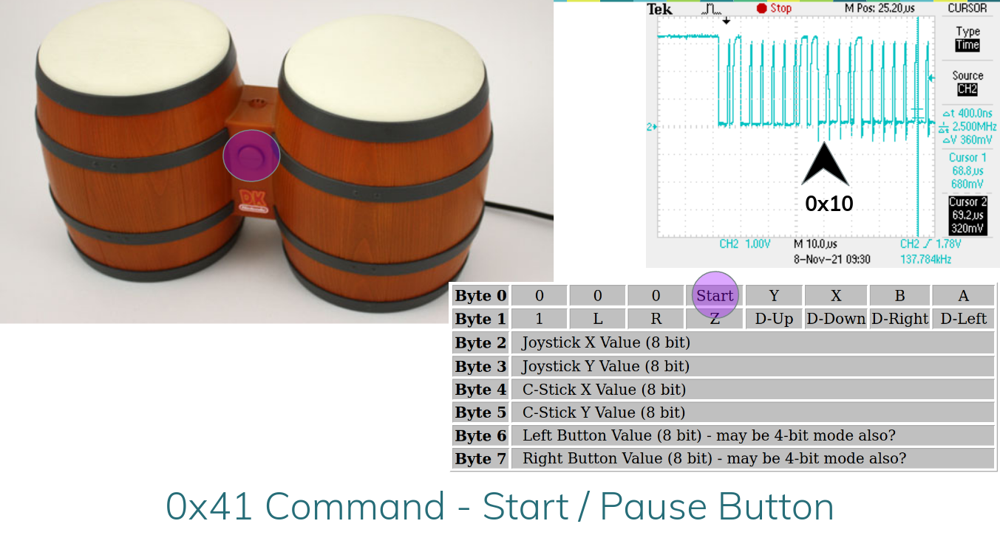

## GameCube Controller Protocol

As mentioned in the [README](../README.md), this project made extensive use of the GameCube Controller Protocol documentation found [here](http://www.int03.co.uk/crema/hardware/gamecube/gc-control.html). The findings presented here were made possible by the research documented on that website. The page does not appear to list the name of the author; nevertheless, I'd like to thank the author for their time and effort.

## Pinout

The GameCube controller has six pins:

1) 3.3V
2) Bidirectional serial data line
3) GND
4) GND
5) (Unused)
6) 3.3V

In the Gamecube Protocol, the clock rate is 1 MHz on the bidirectional serial data line, but four clock pulses are required to send either a zero or a one, meaning the maximum effective bit rate is actually 250 kbaud.

---
## Bit Encoding

On the bidirectional serial data line, logic '0' is encoded as 0V for 3 cycles of a 1 MHz clock, followed by 1 cycle at 3.3V. Similarly, logic '1' is encoded as 0V for 1 cycle of a 1 MHz clock, followed by 3 cycles at 3.3V:

---
## Commands

The GameCube Controller Protocol utilizes a master-slave communication model, where the GameCube is the master, and the controller is the slave. The controller will never freely offer state data to console and must be explicitly polled by the console.

In the case of the DK Bongos, that means that we must send a command to the DK Bongos to find out what inputs are active.

---

---

---

---

